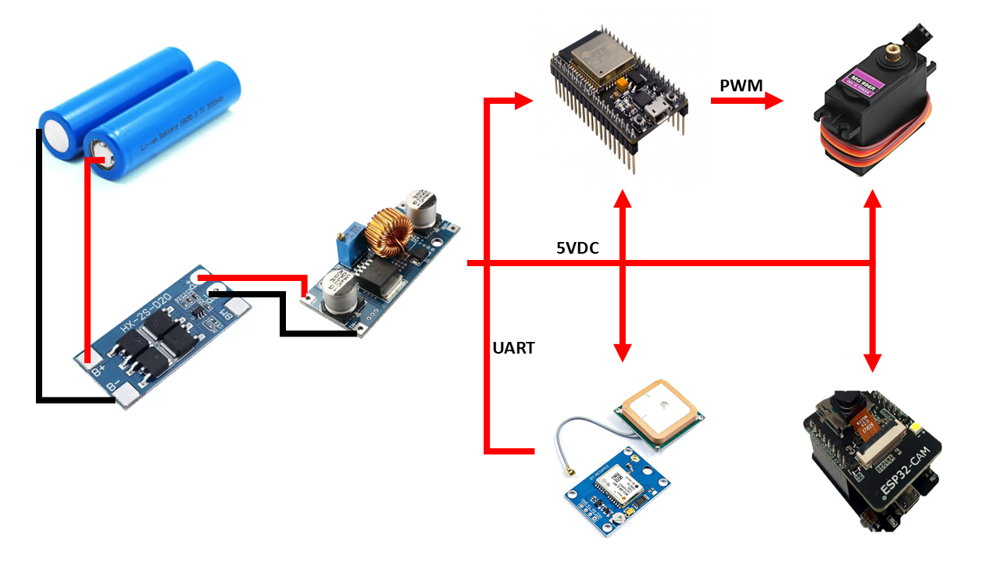
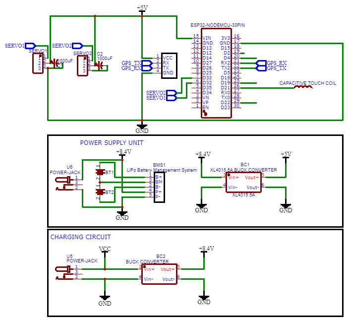

# Smart Hard Hat Documentation

## Table of Contents

1. [Introduction](#introduction)
2. [Parts and Components Used](#parts-and-components-used)
   - [Hardware Components](#hardware-components)
   - [Software Development Tech Stack](#software-development-tech-stack)
   - [3D Printing Tools](#3d-printing-tools)
3. [Circuit Design](#circuit-design)
   - [Power Supply](#power-supply)
   - [Component Connections](#component-connections)
   - [Circuit Diagram](#circuit-diagram)
4. [Algorithm or Pseudocode](#algorithm-or-pseudocode)
5. [Web-Based System Development](#web-based-system-development)
   - [1. Setting Up the Firebase Project](#1-setting-up-the-firebase-project)
   - [2. Development Using the Tech Stack](#2-development-using-the-tech-stack)
   - [3. Purchasing a Domain and Hosting Plan](#3-purchasing-a-domain-and-hosting-plan)
   - [4. Deploying the Website](#4-deploying-the-website)
6. [ESP32 CAM Development](#esp32-cam-development)
   - [Algorithm Overview](#algorithm-overview)
   - [Libraries and Tools Used](#libraries-and-tools-used)
7. [ESP32 DevKit Development](#esp32-devkit-development)
   - [Algorithm Overview](#algorithm-overview-1)
   - [Libraries Used](#libraries-used)
8. [Basic Technical Specifications](#basic-technical-specifications)
   - [Battery Specifications](#battery-specifications)
   - [Materials Used](#materials-used)
   - [Limitations](#limitations)


## Introduction

The Smart Hard Hat is designed specifically for monitoring construction workers in the field. Its primary purpose is to enhance safety and compliance with personal protective equipment (PPE) regulations within the construction industry. This innovative device addresses critical challenges such as ensuring that workers are wearing their hard hats properly and monitoring their activities during work hours at various job sites.

Key features of the Smart Hard Hat include:

- **Location Tracking**: Utilizing a GPS module, the hard hat provides real-time location information of the wearer, enhancing safety and accountability.
- **Wear Detection**: A capacitive touch sensor detects whether the hard hat is being worn, ensuring compliance with safety standards.
- **Image Capturing**: The integrated camera captures images of the wearer, providing a visual record of their presence on site.
- **Web-Based Monitoring**: A comprehensive dashboard allows supervisors to monitor the status of the hard hat (active or inactive), view the coordinates of the wearer, and access images captured in real time. This combination of features aims to improve safety protocols and operational efficiency in the construction industry.


## Parts and Components Used

The Smart Hard Hat is constructed using various electronic components and materials to ensure functionality, durability, and ease of use. Below is a comprehensive list of the parts and components used in the project:
### Hardware Components
- **ESP32 DevKit**: The primary micro-controller for managing data processing and communication.  
  

- **GPS Module (NEO 6M)**: Provides real-time location tracking of the wearer.  
  

- **ESP32 CAM**: Captures images of the user for monitoring purposes.  
  

- **Silicone Wire (24 AWG)**: Used for wear detection connections.  
  

- **18650 LiPo Battery**: Powers the smart hard hat and its components.  
  

- **Battery Management System (BMS)**: Ensures safe charging and discharging of the battery.  
  

- **Buck Converter Module**: Regulates voltage to appropriate levels for the components.  
  

- **Full Metal Servo (MG996)**: Mechanism for deploying and retracting the camera to capture the user's face.  
  

- **Hard Hat**: The protective gear housing all electronic components.  
  

- **3D Printer Filament (PLA)**: Used for 3D printing custom parts and enclosures.  
  

- **Bolts and Nuts**: For assembling components securely.  
  


### Software Development Tech Stack
- **Firebase**: Used for database management and real-time data synchronization.
- **HTML, CSS, JavaScript**: Core technologies for developing the web-based dashboard.
- **PHP**: Serves as the backend language for server-side scripting.
- **Hostinger Web Hosting**: Provides hosting services for the web application.
- **Domain**: smarthardhatmonitoring.online for accessing the web-based dashboard.

### 3D Printing Tools
- **SketchUp Online (Free)**: Used for designing 3D models of parts.
- **OrcaSlicer**: Slicing software for preparing 3D models for printing.
- **Creality 3D Printer**: The printer used for fabricating physical components of the hard hat.


## Circuit Design

The circuit design for the Smart Hard Hat incorporates a 2S LiPo battery with a Battery Management System (BMS) to ensure safe operation and power distribution to the various components. Below is an overview of the key elements in the circuit design:

### Power Supply
- **2S LiPo Battery**: Provides power to the system, connected to a BMS to manage charging and discharging safely.
- **XL4015 Buck Converter**: A voltage regulator used to step down the voltage from the battery to a stable 5V required for the ESP32 DevKit, ESP32 CAM, and servo motor.
- **1000µF Capacitor**: Placed at the power inputs of the servo motor and ESP32 CAM to stabilize the voltage and prevent fluctuations during operation.

### Component Connections
- **ESP32 CAM and ESP32 DevKit**: Both are supplied with a stable 5V from the buck converter, ensuring reliable performance.
- **Capacitive Touch Sensor**: Connected to pin **Touch5** of the ESP32 DevKit, allowing for wear detection by sensing when the hard hat is worn.

### Circuit Diagram





This circuit design effectively integrates power management and component connections, ensuring the reliable operation of the Smart Hard Hat.


## Algorithm or Pseudocode

The Smart Hard Hat utilizes a straightforward algorithm to manage its functionalities, including wear detection, camera deployment, image capturing, and location tracking. Below is the pseudocode representation of the key processes:

### Pseudocode
```plaintext
Initialize system
Connect to Firebase
Initialize components (ESP32 CAM, Buzzer, GPS Module, Capacitive Touch Sensor)

Loop:
    If Capacitive Touch Sensor detects wear:
        Update status in Firebase as "active"
        Trigger buzzer to notify user of camera deployment
        Deploy camera
        Capture image
        Upload image to Firebase
        Turn off buzzer
        Get GPS location
        Update location in Firebase

    Else If Capacitive Touch Sensor does not detect wear:
        Update status in Firebase as "inactive"
        
    Delay for a defined interval
```

## Web-Based System Development

The development of the web-based monitoring system for the Smart Hard Hat involved several key steps, from setting up the Firebase project to deploying the website. Below is an overview of the process:

### 1. Setting Up the Firebase Project
The developer began by creating a Firebase account and logging into the Firebase console. They then initiated a new project specifically for the Smart Hard Hat monitoring system. The database was configured using Firebase Realtime Database to store user statuses, location data, and images. Additionally, Firebase Storage was enabled to handle image uploads from the ESP32 CAM. Firebase Authentication was also implemented to ensure secure access to the dashboard.

Afterward, the Firebase SDK was obtained and integrated into the web application, laying the groundwork for the system's functionality.

### 2. Development Using the Tech Stack
For the development environment, Visual Studio Code (VS Code) was used as the Integrated Development Environment (IDE). The frontend of the web application was built utilizing HTML for structure, CSS for styling, and JavaScript for interactivity. To display the location on maps, the developer integrated Mapbox, allowing for dynamic visualization of user coordinates.

PHP was employed for server-side scripting, enabling effective handling of database interactions and user requests. Throughout this phase, the developer focused on integrating the Firebase SDK to connect the web app with the Firebase project, allowing for real-time updates and efficient data management.

### 3. Purchasing a Domain and Hosting Plan
Once development progressed, an appropriate domain name was selected that reflected the purpose of the Smart Hard Hat project. After finalizing the choice, the domain was registered and a hosting plan was purchased through Hostinger, a reliable hosting service that supported the tech stack and provided essential features like SSL certificates for security.

The hosting plan was set up to prepare for the web application's deployment.

### 4. Deploying the Website
When it came time to deploy the website, the developer uploaded the application files to the server using an FTP client, as well as the hosting provider’s control panel. They ensured that the web app was correctly configured to connect to the Firebase Realtime Database and Firebase Storage. Following this, thorough testing of all features was conducted, including real-time updates, image uploads, location tracking, and Mapbox integration.

Once testing was complete and all functionalities worked as expected, the website was made live for users to access at the purchased domain.

## ESP32 CAM Development

The development of the ESP32 CAM functionality for the Smart Hard Hat involved creating an efficient system for capturing images and managing data uploads. The following outlines the process and key components of this development.

### Algorithm Overview
The core of the ESP32 CAM development centered around a robust algorithm designed to listen for changes in the Firebase Realtime Database. The steps of the algorithm are as follows:

1. **Listen for Database Changes**: The ESP32 CAM continuously monitored the Firebase Realtime Database for any updates to the status of the Smart Hard Hat.

2. **Check Status**: When the status was updated to "active," the algorithm proceeded to the next step.

3. **Deploy Camera**: The camera deployment mechanism was triggered, positioning the camera to capture an image of the wearer.

4. **Capture Image**: The ESP32 CAM captured an image using its built-in camera.

5. **Upload Image**: The captured image was uploaded to Firebase Storage, ensuring that it was securely stored in the cloud.

6. **Write Image URL to Database**: After successfully uploading the image, the algorithm wrote the URL of the uploaded image back to the Firebase Realtime Database. This enabled the web-based dashboard to access and display the image.

7. **Write Image Capture Status**: The algorithm then updated the database with a status indicating that the image capture was successful. This action triggered the retraction mechanism of the camera.

### Libraries and Tools Used
To facilitate the integration with Firebase, the developer utilized the Firebase ESP Client library. This library provided the necessary functions for interacting with the Firebase Realtime Database and Firebase Storage, enabling seamless data management and retrieval.

The ESP32 CAM was programmed to maintain a stable connection to the Wi-Fi network, allowing it to listen for database changes and execute the image capture and upload sequence in real time.

Overall, the ESP32 CAM development phase effectively enabled the Smart Hard Hat to monitor the wearer's status and capture images when necessary, enhancing the overall functionality of the monitoring system.

## ESP32 DevKit Development

The development of the ESP32 DevKit functionality for the Smart Hard Hat focused on implementing wear detection and managing interactions between components. The following outlines the process and key components of this development.

### Algorithm Overview
The algorithm for the ESP32 DevKit was designed to perform the following steps:

1. **Wait for Capacitive Touch Sensor**: The system continuously monitored the capacitive touch sensor to detect whether the hard hat was being worn.

2. **Turn On Beeper Buzzer**: Upon detection of the hard hat being worn, the algorithm activated a buzzer to notify the user.

3. **Deploy Camera Using Servo**: The servo motor was triggered to deploy the camera, positioning it for image capture.

4. **Update Camera Status in Firebase**: The algorithm wrote an update to the Firebase Realtime Database to signal the ESP32 CAM to initiate image capture.

5. **Wait for Capture Success**: The system waited for the status in the database to confirm that the image capture was successful.

6. **Retract Camera**: Once capture success was confirmed, the camera was retracted back to its original position.

7. **Turn Off Beeping**: The beeping of the buzzer was disabled.

8. **Get Location**: The GPS module was activated to retrieve the current location of the hard hat.

9. **Update Location in Firebase**: The retrieved location data was sent to the Firebase Realtime Database for monitoring.

10. **Wait for Unwear Detection**: The system continued to monitor the capacitive touch sensor for a signal indicating that the hard hat was no longer being worn.

11. **Set Inactive in Database**: Once unwear detection occurred, the algorithm updated the Firebase database to set the status to inactive.

### Libraries Used
The following libraries were utilized during the development of the ESP32 DevKit functionality:

- [Firebase ESP Client](https://github.com/FirebaseExtended/firebase-arduino): For integrating with Firebase services.
- [ESP32 Servo Library](https://github.com/me-no-dev/ESP32Servo): For controlling the servo motor.
- [TinyGPS++](https://github.com/mikalhart/TinyGPSPlus): For parsing GPS data.


## Basic Technical Specifications

The Smart Hard Hat is designed with various components and specifications to ensure optimal performance and durability in construction environments. The following outlines the key technical specifications, including operational limitations:

### Battery Specifications
- **Battery Type**: Lithium Polymer (LiPo)
- **Capacity**: 3600 mAh
- **Voltage**: 3.7V (nominal)
- **Runtime**: The battery can last at least 10 hours on a full charge.

### Materials Used
- **Hard Hat**: 
  - Material: High-Density Polyethylene (HDPE) or similar
  - Features: Lightweight, impact-resistant, and compliant with safety standards.

- **Camera Housing**: 
  - Material: 3D Printed PLA (Polylactic Acid)
  - Features: Durable and lightweight, designed for optimal fit and protection of the ESP32 CAM.

- **Wiring**: 
  - Type: 24 AWG Silicone Wire
  - Features: Flexible, heat-resistant, and suitable for low-voltage applications.

- **Servo Motor**: 
  - Type: Full Metal MG996
  - Features: High torque and durability, ideal for deploying and retracting the camera.

- **Buzzer**: 
  - Type: Piezo Buzzer
  - Features: Compact and effective for audio notifications.

- **GPS Module**: 
  - Type: NEO-6M GPS Module
  - Features: High sensitivity, reliable positioning for outdoor environments.

| #  | Item                                 | Unit | Quantity | Unit Price | Total Amount |
|----|--------------------------------------|------|----------|------------|--------------|
| 1  | ESP32 cam                            | pc   | 1        | 350        | 350          |
| 2  | NodeMCU ESP32                        | pc   | 1        | 350        | 350          |
| 3  | GPS Module Neo 6m                    | pc   | 1        | 250        | 250          |
| 4  | 18650 Battery                        | pc   | 2        | 150        | 300          |
| 5  | Battery Management System 1s         | pc   | 1        | 100        | 100          |
| 6  | Boost Converter Module               | pc   | 1        | 500        | 500          |
| 9  | Momentary Push Button Switch         | pc   | 2        | 10         | 20           |
| 10 | Aluminum Servo Horn 25T              | pc   | 2        | 75         | 150          |
| 11 | MG996 Full Metal Servo               | pc   | 2        | 300        | 600          |
| 12 | Copper Tube                          | ft   | 3        | 50         | 150          |
| 13 | PLA+ Filament                        | kg   | 3        | 900        | 2700         |
| 14 | Website Domain Name                  | yr   | 1        | 3000       | 3000         |
| 15 | M3 Bolts and Nuts Kit                | pack | 1        | 500        | 500          |
| 16 | M3 Rivet Nut                         | pack | 1        | 200        | 200          |
| 17 | M2 Brass Standoff Kit                | pack | 1        | 700        | 700          |
| 18 | M3 Brass Standoff Kit                | pack | 1        | 1000       | 1000         |
| 19 | M5 Rivet Nut                         | pack | 1        | 400        | 400          |
| 20 | Website Hosting Service Subscription | month | 3       | 249        | 747          |
|    |                                      |      |          | **Total**  | **12017**    |


### Limitations
- **GPS Module Limitations**: 
  - The GPS module performs optimally in open areas; its effectiveness diminishes in multi-floor construction sites where signals may be obstructed.
  
- **Wi-Fi Connection**: 
  - A stable Wi-Fi connection is required for real-time data uploads and communication with the web dashboard.
  
- **Daily Charging**: 
  - The battery needs to be charged daily to ensure uninterrupted operation throughout work shifts.

